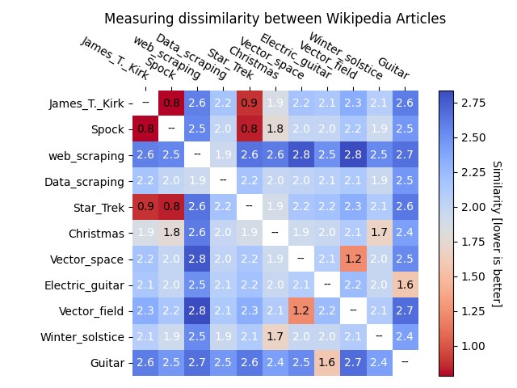

# Document Similarity

It can be a useful thing, if you have a large collection of documents,
to have an automated procedure to find a document that's similar to
the one you're currently looking at.  For example, a forensic accountant
might want to look at more expense reports that are in some way similar
to one that caught her eye, but there might be tens of thousands of such
reports.

By summarizing a document as a simple vector of word counts, we can use
some simple linear algebra to compare documents and get a measure for
their **dis**similarity.  With this measure, low values mean documents
are similar, and the higher the measurement goes the less similar they are.

This project has been designed to work only
with Wikipedia articles because of their permissive licence for scraping
data. A standard dictionary has been created
by finding the 4000 most common words in 1000 random Wikipedia articles,
including only words with more than three letters. The feature vector
of any document is simply the counts of those words in each document,
standardized to $[0, 1]$. *Dictionary* in this context can be read
as *allowed words for the purpose of this analysis.*

The dissimilarity of two documents is then computed as the L2 norm of the difference
of their standardized feature vectors: $\large \text{diff} = \lVert f_1 - f_2 \rVert$  

A feature vector of this kind doesn't account for which words are next to
one another or in the same sentence or paragraph. It doesn't matter 
how long the document is, or how it is formatted. It's just a list like
`(dinner: 12, mario: 4, regent: 0, quick: 1, ...)` and as the basis of a
method to classify documents it works surprisingly well.

As an example, a sample of 11 Wikipedia articles has been read and their
dissimilarities computed.  The higher the number, the more different they
are. The lower the number, the more similar. Documents on similar subjects
clearly show lower (*better*) scores.

## Possible improvements

1. Scrape a larger corpus of documents before creating the dictionary, for a more representative sample.
    1. e.g. `Beyoncé` is currently in the dictionary as one of the most common words on English Wikipedia,
    but this is (probably..) related to the random choice of web pages to scan while creating the dictionary.
2. More text processing on the dictionary. Currently, words may include punctuation and numbers.
3. Word stemming. The current dictionary contains `agree`, `agreed`, `agreement` and `agreements`.
Word stemming would transform them all into one word, `agree`. Doing this over the entire dictionary, 
*which is limited to 4000 words*, would
allow for a much greater variety of words to be considered, probably improving the dissimilarity measurement.